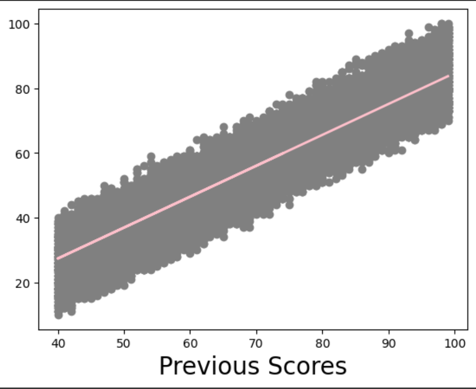
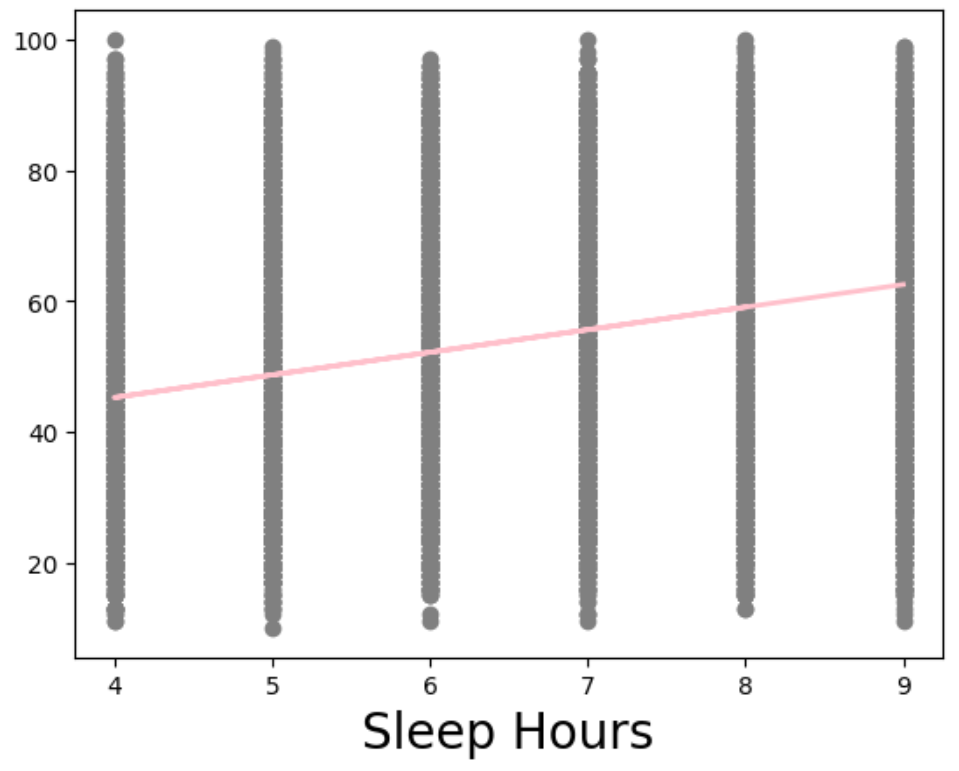
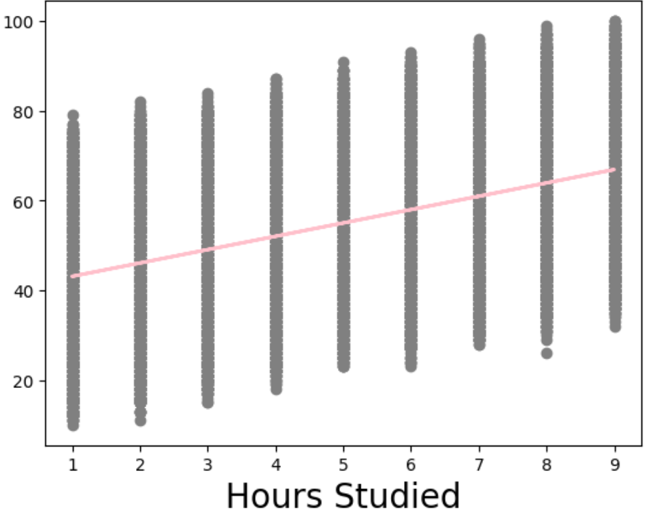

# Simple Linear Regression
implement from Scratch 

## Features

| Variable Name                       | Description of Variable                                                                 |
|-------------------------------------|-----------------------------------------------------------------------------------------|
| **Hours Studied**                   | The total number of hours spent studying by each student                                |
| **Previous Scores**                 | The scores obtained by students in previous tests                                       |
| **Sleep Hours**                     | The average number of hours of sleep the student had per day                            |
| **Sample Question Papers Practiced**| The number of sample question papers the student practiced                              |
| **Performance Index**               | The performance index represents the student's academic performance. The index ranges from 10 to 100, with higher values indicating better performance. |

## Table: Summary of Mean Square Error for Each Model

| Variable                  | Mean Square Error | m   | c   | L    | Epochs |
|---------------------------|-------------------|-----|-----|------|--------|
| Previous Scores           | 61.059            | 800 | 0   | 0.0001 | 70     |
| Sleep Hours               | 394.189           | 80  | 0   | 0.01  | 900    |
| Hours Studied             | 317.868           | 80  | 0   | 0.01  | 900    |
| Sample Question Papers Practiced | 368.539     | 40  | 0   | 0.01  | 800    |

## The Different Models

- ### Previous Scores  

- ###  Sleep Hours   

- ### Hours Studied   

- ### Sample Question Papers Practiced  

## Conclusion
According to MSE, it can be concluded that the feature “Previous Score” is the best because it has the lowest MSE compared to the other variables evaluated. Lower MSE indicates better predictive performance.
